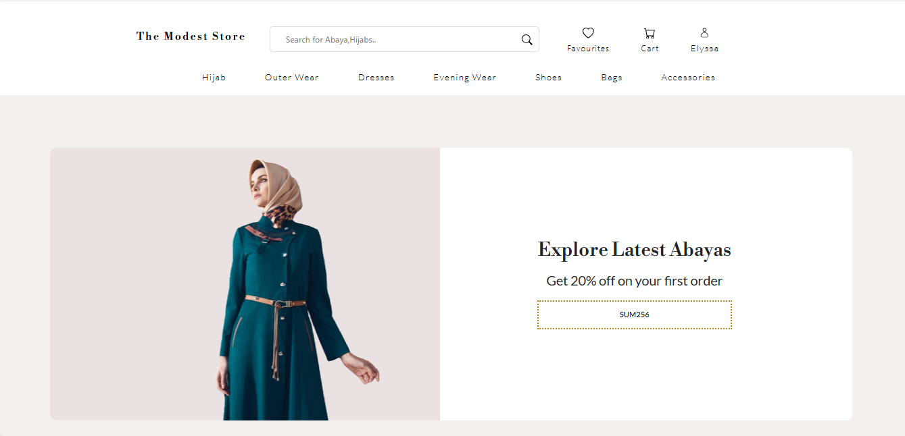
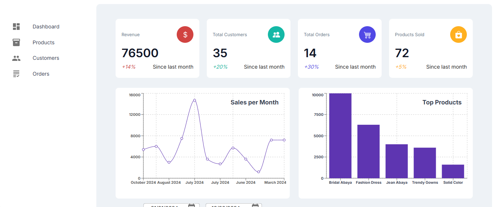

# MERN E-Commerce Clothing Store

### Overview
This project is a comprehensive e-commerce platform for a clothing store, developed using the MERN stack (MongoDB, Express.js, React, and Node.js). It includes features such as user authentication, product management, shopping cart functionality, and a powerful admin panel for managing products and orders.

### Screenshots

#### Home Page


#### Admin Panel


### Features

### Features

#### Frontend
- **User Authentication**: Sign up, log in, and log out functionality with Google OAuth for a seamless login experience.
- **Product Listing**: Browse, search, and filter clothing items.
- **Product Details**: View detailed information about each product.
- **Shopping Cart**: Add products to the cart and proceed to checkout.
- **Order Summary**: Review order details before finalizing purchase.
- **Responsive Design**: Mobile-friendly layout for an optimal shopping experience on all devices.
- **Automated Slideshow**: Responsive and animated product image slider on the homepage.

#### Backend
- **User Management**: Handle user registration, authentication, and profile management. Supports Google OAuth integration.
- **Product Management**: CRUD operations for managing products in the database.
- **Order Management**: Process orders, handle payments, and manage order statuses.
- **JWT Authentication**: Secure routes and ensure secure user sessions using JSON Web Tokens.
- **Error Handling**: Centralized error handling for consistent and clear error responses.

#### Admin Panel
- **Product Management**: Add, update, delete, and list products.
- **Order Management**: View and manage customer orders.
- **User Management**: Manage user roles and active status.
- **Dashboard**: Overview of key metrics like total revenue, number of orders, no of customers,product sold and charts to display sales per month and top selling products.
- **Inventory Management**: : Track stock levels and manage inventory efficiently.


### Installation
1. **Clone the repository**
   ```sh
   git clone https://github.com/naf1993/mernclothingstore.git
   cd mern-ecommerce-clothing-store

2. **Install server dependencies
    cd backend
    npm install
3. **Install client dependencies
    cd frontend
    npm install
4. **Install admin dependencies
    cd ecommerce-dashboard-admin
    npm install
5. **Create a .env file in the root folder and add the following
    PORT=5000
    MONGO_URI_LOCAL=mongodb://127.0.0.1:27017/mern_ecommerce
    MONGO_URL_HOST=your mongodb_uri
    NODE_ENV=development
    GOOGLE_CLIENT_ID=your google client id
    GOOGLE_CLIENT_SECRET=your google client secret
    GOOGLE_CALLBACK_URL=callback url
    CLOUD_NAME=cloudinary name
    API_KEY=cloudinary api key
    API_SECRET=cloudinary api secret
    JWT_SECRET=your jwt secret
    JWT_EXPIRES_IN=jwtexpiresin
    JWT_COOKIE_EXPIRES_IN=jwtcookieexpiresin
    STRIPE_PUBLIC_KEY=your stripe public key
    STRIPE_API_KEY=your stripe private key
    EMAIL_USER=email
    EMAIL_PASSWORD=password
    BASE_API_URL=api


### Usage
1. **Start Backend**
    npm run server
2. **Start Frontend**
    npm start
3. **Run both Backend and Frontend**
    npm run dev

  